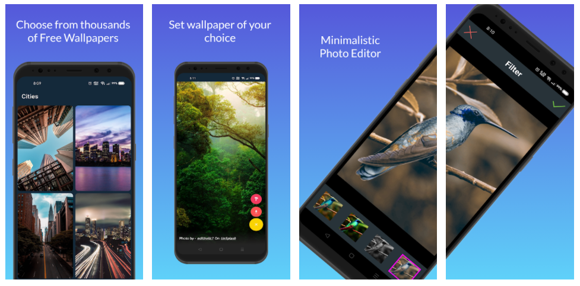

# PIXAR
**Minimalistic Android application following MVVM architecture with Photo Editor and Wallpapers support. User can edit any .jpg or .png Images.
Also User can choose or search Thousands of Images for Device wallpaper.**


<a href='https://play.google.com/store/apps/details?id=com.techk.pixar'></a>


# DESCRIPTION 

- Application Name - **PIXAR**
- Architecture Used - MVVM
- Language Used - Kotlin (v1.4.32)
- IDE used - Android Studio (v4.1.2)  


## 🚀 FEATURES
- Photo Editor
- Get Wallpapers of your choice.
- Retrieve data with pagination.
- Set Lock/ome Screen Wallpapers.
- Material Design
- Clean MVVM Architecture.


## ⚙ TECH USED
- Unsplash Api
- Kotlin
- Model-View-Viewmodel Architecture
- Navigation component
- Retrofit 2
- JSON parsing
- Live Data
- ViewModel
- Paging3
- DiffUtil
- Admob
- Activity Result Contracts

## :computer: CODE BASE

- :x: NO Errors
- :x: NO Hard Coded Code
- :x: NO Boiler Plate Code
- :x: NO Warnings
- :x: NO Deprecated Code
- :heavy_check_mark: Naming Convention Followed
- :heavy_check_mark: Well Maintained Package Structure
- :heavy_check_mark: Minimal & Clean Code

## DEPENDENCIES 

```
    // Navigation Component
    implementation("androidx.navigation:navigation-fragment-ktx:2.3.5")
    implementation("androidx.navigation:navigation-ui-ktx:2.3.5")

    // Dagger Hilt
    implementation "com.google.dagger:hilt-android:2.35"
    kapt "com.google.dagger:hilt-compiler:2.35"

    // Scalable Size Units
    implementation 'com.intuit.sdp:sdp-android:1.0.6'
    implementation 'com.intuit.ssp:ssp-android:1.0.6'

    // Glide
    implementation 'com.github.bumptech.glide:glide:4.12.0'
    annotationProcessor 'com.github.bumptech.glide:compiler:4.12.0'

    // Retrofit
    implementation 'com.squareup.retrofit2:retrofit:2.9.0'
    implementation 'com.squareup.retrofit2:converter-gson:2.9.0'

    // Paging
    implementation "androidx.paging:paging-runtime-ktx:3.0.1"

    // DS Photo Editor SDK
    implementation fileTree(dir: 'libs', include: ['*.jar'])
    implementation(name:'ds-photo-editor-sdk-v10', ext:'aar')

    // SDK related dependencies
    implementation 'io.reactivex.rxjava2:rxjava:2.1.0'
    implementation 'io.reactivex.rxjava2:rxandroid:2.0.1'

    // Admob Ads
    implementation 'com.google.android.gms:play-services-ads:20.2.0'
```

## License

    Copyright (c) 2021 YASH KUMAR

    Permission is hereby granted, free of charge, to any person obtaining a copy of this software and associated documentation files (the "Software"), to deal
    in the Software without restriction, including without limitation the rights to use, copy, modify, merge, publish, distribute, sublicense, and/or sell
    copies of the Software, and to permit persons to whom the Software is furnished to do so, subject to the following conditions:

    The above copyright notice and this permission notice shall be included in all copies or substantial portions of the Software.

    THE SOFTWARE IS PROVIDED "AS IS", WITHOUT WARRANTY OF ANY KIND, EXPRESS OR IMPLIED, INCLUDING BUT NOT LIMITED TO THE WARRANTIES OF MERCHANTABILITY,
    FITNESS FOR A PARTICULAR PURPOSE AND NONINFRINGEMENT. IN NO EVENT SHALL THE AUTHORS OR COPYRIGHT HOLDERS BE LIABLE FOR ANY CLAIM, DAMAGES OR OTHER
    LIABILITY, WHETHER IN AN ACTION OF CONTRACT, TORT OR OTHERWISE, ARISING FROM, OUT OF OR IN CONNECTION WITH THE SOFTWARE OR THE USE OR OTHER DEALINGS IN THE
    SOFTWARE.
